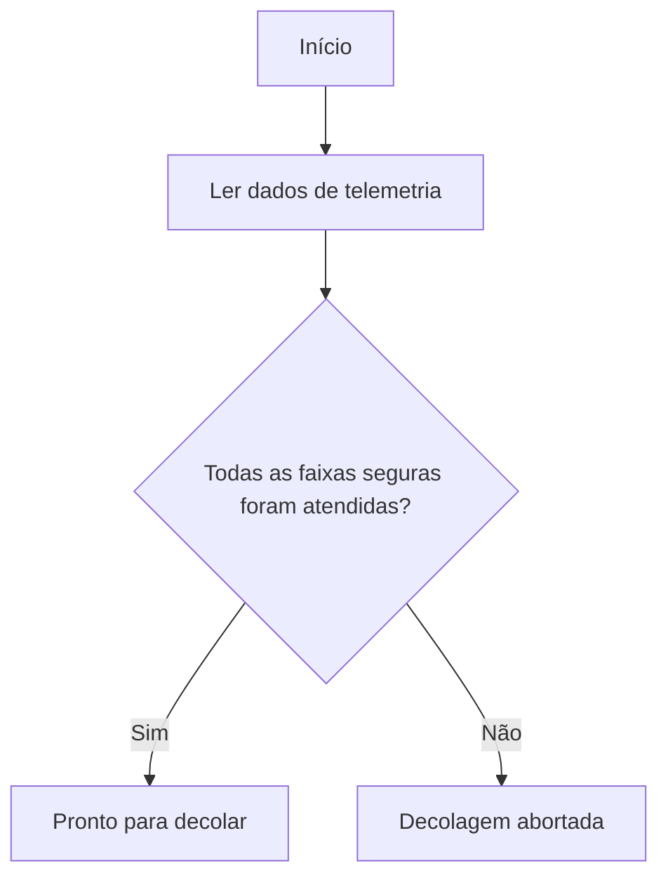

# PBL - Relatório Operacional de Pré-Decolagem

Projeto desenvolvido para o primeiro semestre de Ciência da Computação com base no PBL da missão Aurora. O objetivo é interpretar dados de telemetria, decidir se a nave está pronta para decolar, calcular a autonomia energética inicial, registrar uma análise assistida por IA, usar `pandas` para apoiar a visualização dos dados e consolidar a documentação pedida no enunciado.

## Objetivos do projeto

- Organizar e interpretar a telemetria inicial da missão.
- Construir um algoritmo de verificação com fluxograma e pseudocódigo.
- Implementar o algoritmo em Python.
- Apresentar os cálculos da análise energética.
- Registrar uma análise assistida por IA.
- Usar `pandas` para organizar os dados em DataFrames e apoiar a visualização.
- Preparar material para o relatório em PDF e para o repositório GitHub.

## Repositório público

- GitHub: [https://github.com/dandgsf/pbl-aurora-pre-decolagem](https://github.com/dandgsf/pbl-aurora-pre-decolagem)

## Pré-requisitos

- Python 3.12 ou superior
- `pip` disponível no ambiente
- Dependências listadas em `requirements.txt`
- Acesso à internet apenas para a etapa opcional de geração da evidência externa de IA

## Estrutura do repositório

```text
pbl-aurora-pre-decolagem/
  assets/prints/
  data/
  docs/
  notebooks/
  report/
  scripts/
  src/
  README.md
  requirements.txt
```

## Telemetria analisada

| Variável | Descrição |
| --- | --- |
| Temperatura interna e externa | Verifica a estabilidade térmica da nave. |
| Integridade estrutural | Indica se o casco está apto para o lançamento. |
| Nível de energia | Mede a carga disponível em percentual. |
| Pressão dos tanques | Verifica a segurança operacional dos tanques. |
| Status dos módulos críticos | Confirma navegação, comunicação, propulsão e suporte de vida. |

As faixas seguras adotadas estão em [docs/algoritmo.md](docs/algoritmo.md).

## Algoritmo de verificação

### Pseudocódigo resumido

```text
INÍCIO
    ler dados de telemetria
    se alguma variável crítica estiver fora da faixa segura
        exibir "DECOLAGEM ABORTADA"
    senão
        exibir "PRONTO PARA DECOLAR"
FIM
```

### Fluxograma



## Como executar

### 1. Criar ambiente virtual

```powershell
python -m venv .venv
.venv\Scripts\Activate.ps1
python -m pip install --upgrade pip
python -m pip install -r requirements.txt
```

### 2. Executar o script principal

```powershell
python -m src.main
```

### 3. Gerar os artefatos auxiliares

```powershell
python scripts/create_execution_assets.py
python scripts/generate_report_pdf.py
```

### 4. Gerar a evidência externa de IA

```powershell
python scripts/generate_ai_evidence.py
```

## Notebook

O notebook solicitado pelo enunciado está em [notebooks/pbl_pre_decolagem.ipynb](notebooks/pbl_pre_decolagem.ipynb). Ele organiza a telemetria com `pandas`, reaplica os cálculos energéticos e documenta a etapa de IA.

## Arquivos principais

- Código principal: [src/main.py](src/main.py)
- Visualização com pandas: [src/visualization.py](src/visualization.py)
- Regras de verificação: [src/checks.py](src/checks.py)
- Análise energética: [src/energy.py](src/energy.py)
- Análise assistida por IA: [src/ai_analysis.py](src/ai_analysis.py)
- Relatório em Markdown: [report/relatorio_operacional.md](report/relatorio_operacional.md)
- PDF do relatório: [report/relatorio_operacional.pdf](report/relatorio_operacional.pdf)
- Evidência externa de IA em Markdown: [report/ai_assisted_analysis.md](report/ai_assisted_analysis.md)
- Evidência externa de IA em JSON: [report/ai_assisted_analysis.json](report/ai_assisted_analysis.json)

## Prints da execução

Os artefatos da execução ficam em:

- [assets/prints/execution_output.txt](assets/prints/execution_output.txt)
- [assets/prints/execution_output.png](assets/prints/execution_output.png)
- [assets/prints/telemetry_dashboard.png](assets/prints/telemetry_dashboard.png)

## Evidências visuais

### Execução do script principal


### Suíte de testes


### Dashboard de telemetria


## Evidência real de IA

Além da classificação local por regras, o projeto agora inclui uma evidência externa de análise por LLM nos arquivos abaixo:

- [report/ai_assisted_analysis.md](report/ai_assisted_analysis.md)
- [report/ai_assisted_analysis.json](report/ai_assisted_analysis.json)

Essa evidência foi incorporada ao relatório em PDF sem substituir a implementação local já existente.

## Resultado esperado

- AURORA-01: pronto para decolar.
- AURORA-02: decolagem abortada por energia abaixo do mínimo.
- AURORA-03: decolagem abortada por falhas estruturais e operacionais.
