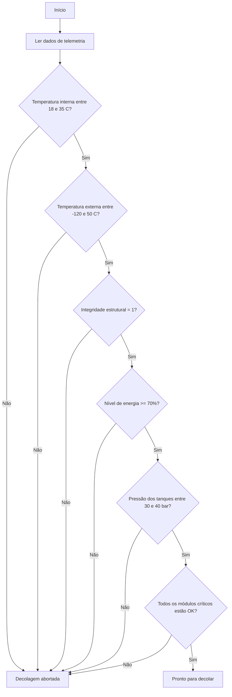

# Algoritmo de Verificação

## Faixas seguras adotadas

| Variável | Faixa segura | Justificativa didática |
| --- | --- | --- |
| Temperatura interna | 18 C a 35 C | Mantém os módulos operando sem superaquecimento. |
| Temperatura externa | -120 C a 50 C | Considera variações ambientais severas sem comprometer sensores externos. |
| Integridade estrutural | 1 | O casco deve estar íntegro para a decolagem. |
| Nível de energia | 70% a 100% | Garante margem operacional mínima para o início da missão. |
| Pressão dos tanques | 30 a 40 bar | Mantém os tanques em uma faixa segura de operação. |
| Módulos críticos | Todos em `OK` | Navegação, comunicação, propulsão e suporte de vida devem estar ativos. |

## Pseudocódigo

```text
INÍCIO
    ler temperatura_interna
    ler temperatura_externa
    ler integridade_estrutural
    ler nivel_energia
    ler pressao_tanques
    ler status_navegacao
    ler status_comunicacao
    ler status_propulsao
    ler status_suporte_vida

    se temperatura_interna < 18 ou temperatura_interna > 35 entao
        exibir "DECOLAGEM ABORTADA"
    senão se temperatura_externa < -120 ou temperatura_externa > 50 entao
        exibir "DECOLAGEM ABORTADA"
    senão se integridade_estrutural <> 1 entao
        exibir "DECOLAGEM ABORTADA"
    senão se nivel_energia < 70 entao
        exibir "DECOLAGEM ABORTADA"
    senão se pressao_tanques < 30 ou pressao_tanques > 40 entao
        exibir "DECOLAGEM ABORTADA"
    senão se algum modulo_critico <> "OK" entao
        exibir "DECOLAGEM ABORTADA"
    senão
        exibir "PRONTO PARA DECOLAR"
    fimse
FIM
```

## Fluxograma


