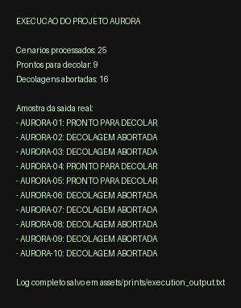
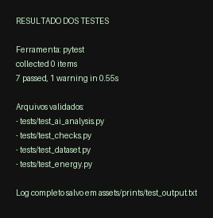
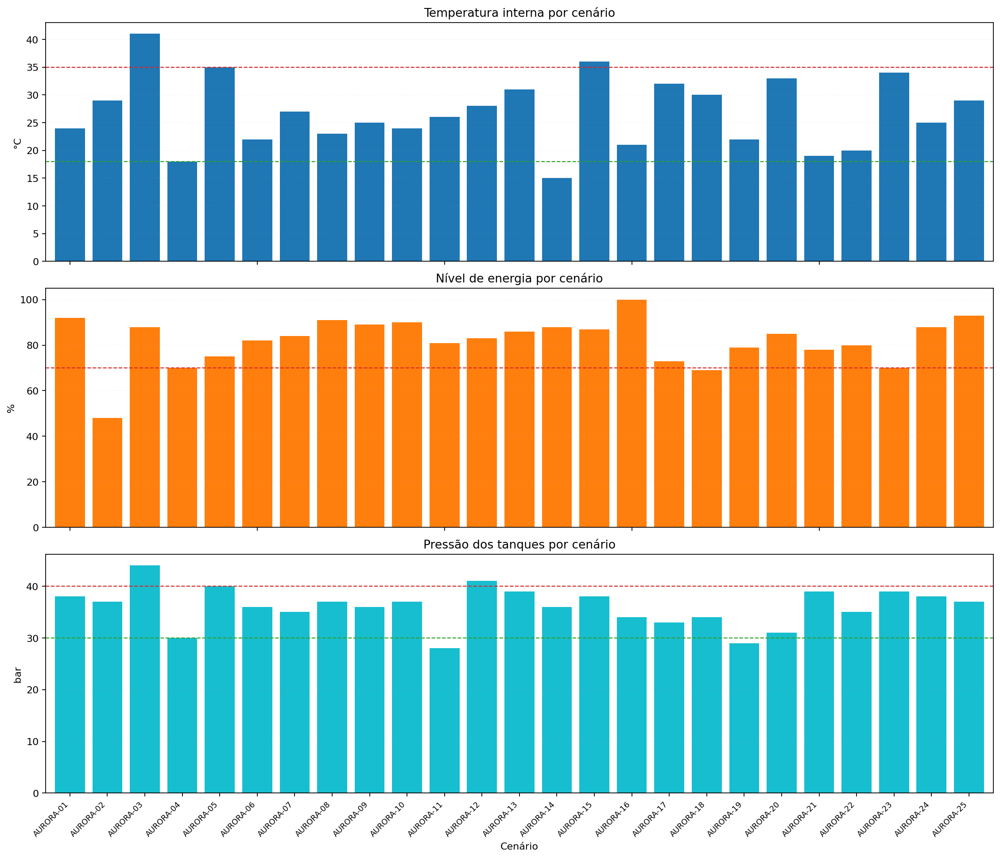

# Relatório Operacional de Pré-Decolagem

## 1. Introdução

Este relatório apresenta a análise da telemetria inicial da nave Aurora, a construção do algoritmo de verificação da missão, a implementação em Python, a análise energética, uma etapa de análise assistida por IA e uma reflexão crítica sobre ética, impacto social e sustentabilidade tecnológica. Nesta versão final, a base `data/telemetry_samples.csv` foi ampliada para 25 registros de telemetria, conforme o requisito da atividade.

### 1.1 Repositório público no GitHub

O projeto também está disponível em repositório público para inspeção do avaliador:

https://github.com/dandgsf/pbl-aurora-pre-decolagem

## 2. Organização e descrição da telemetria

### 2.1 Variáveis monitoradas

| Variável | Unidade | Regra adotada |
| --- | --- | --- |
| Temperatura interna | C | Deve permanecer entre 18 e 35 C |
| Temperatura externa | C | Deve permanecer entre -120 e 50 C |
| Integridade estrutural | 0 ou 1 | Deve ser igual a 1 |
| Nível de energia | % | Deve ser maior ou igual a 70% |
| Pressão dos tanques | bar | Deve permanecer entre 30 e 40 bar |
| Módulos críticos | OK ou FAIL | Todos devem estar em OK |

### 2.2 Base consolidada com 25 cenários

O arquivo `data/telemetry_samples.csv` contém 25 cenários completos de telemetria, além do cabeçalho. A tabela abaixo mostra uma amostra representativa da base utilizada na execução final.

| Cenário | Temp. interna | Temp. externa | Integridade | Energia | Pressão | Módulos críticos |
| --- | --- | --- | --- | --- | --- | --- |
| AURORA-01 | 24 C | -45 C | 1 | 92% | 38 bar | Todos OK |
| AURORA-02 | 29 C | -30 C | 1 | 48% | 37 bar | Todos OK |
| AURORA-03 | 41 C | -18 C | 0 | 88% | 44 bar | Comunicação em FAIL |
| AURORA-04 | 18 C | -95 C | 1 | 70% | 30 bar | Todos OK |
| AURORA-16 | 21 C | -25 C | 1 | 100% | 34 bar | Todos OK |
| AURORA-24 | 25 C | -22 C | 1 | 88% | 38 bar | Navegação, comunicação e suporte de vida em FAIL |

### 2.3 Interpretação inicial

- A base final possui 25 registros processáveis pela aplicação.
- Entre eles, 9 cenários retornam `PRONTO PARA DECOLAR` e 16 retornam `DECOLAGEM ABORTADA`.
- Foram incluídos casos nominais, falhas críticas, valores limítrofes válidos e valores limítrofes inválidos para testar as regras do algoritmo.
- Os cenários AURORA-04, AURORA-05, AURORA-21 e AURORA-23 validam que os limites seguros são aceitos quando o valor está exatamente na borda operacional.

## 3. Algoritmo de verificação

O algoritmo foi modelado para decidir entre `PRONTO PARA DECOLAR` e `DECOLAGEM ABORTADA` a partir de verificações sequenciais.

### 3.1 Pseudocódigo

```text
INÍCIO
    ler dados de telemetria
    se temperatura interna fora da faixa então abortar
    senão se temperatura externa fora da faixa então abortar
    senão se integridade estrutural diferente de 1 então abortar
    senão se nível de energia menor que 70% então abortar
    senão se pressão dos tanques fora da faixa então abortar
    senão se algum módulo crítico estiver em FAIL então abortar
    senão autorizar a decolagem
FIM
```

O fluxograma completo está documentado em [docs/algoritmo.md](../docs/algoritmo.md).

## 4. Script em Python

O script principal lê o arquivo `data/telemetry_samples.csv` com `pandas`, aplica as verificações da missão, calcula a autonomia energética e gera uma análise assistida por IA. Para a entrega final, também foi incluída uma suíte de testes automatizados com `pytest`.

### 4.1 Estrutura dos arquivos

- `src/checks.py`: regras da telemetria e decisão de decolagem.
- `src/energy.py`: cálculos de energia e autonomia.
- `src/ai_analysis.py`: prompt e classificação assistida.
- `src/visualization.py`: leitura tabular com `pandas` e geração do dashboard gráfico.
- `src/main.py`: leitura dos dados e impressão do resultado final.
- `tests/`: suíte automatizada com 7 testes.
- `scripts/create_execution_assets.py`: geração dos logs e dos prints.
- `scripts/generate_report_pdf.py`: conversão do relatório Markdown para PDF com imagens.

### 4.2 Resultado consolidado da execução

- A execução final processa 25 cenários.
- 9 cenários foram classificados como `PRONTO PARA DECOLAR`.
- 16 cenários foram classificados como `DECOLAGEM ABORTADA`.
- Os cenários de referência seguem consistentes:
- AURORA-01: `PRONTO PARA DECOLAR`
- AURORA-02: `DECOLAGEM ABORTADA`
- AURORA-03: `DECOLAGEM ABORTADA`

### 4.3 Trechos representativos do código Python

Os trechos abaixo foram acrescentados ao relatório para que o PDF também contenha evidência direta do código executado, sem substituir o notebook completo enviado separadamente.

```python
def load_telemetry(file_path):
    dataframe = pd.read_csv(file_path)
    dataframe[FLOAT_FIELDS] = dataframe[FLOAT_FIELDS].astype(float)
    dataframe[INT_FIELDS] = dataframe[INT_FIELDS].astype(int)
    return dataframe.to_dict(orient="records")
```

```python
def evaluate_telemetry(record):
    checks = []
    anomalies = []
    ...
    ready = all(item["passed"] for item in checks)
    decision = "PRONTO PARA DECOLAR" if ready else "DECOLAGEM ABORTADA"
    return {
        "ready": ready,
        "decision": decision,
        "checks": checks,
        "anomalies": anomalies,
    }
```

```python
def calculate_energy_analysis(total_capacity_kwh, current_charge_pct,
                              estimated_launch_consumption_kwh, loss_pct):
    stored_energy_kwh = total_capacity_kwh * (current_charge_pct / 100)
    usable_energy_kwh = stored_energy_kwh * (1 - (loss_pct / 100))
    remaining_after_launch_kwh = usable_energy_kwh - estimated_launch_consumption_kwh
    return {
        "stored_energy_kwh": stored_energy_kwh,
        "usable_energy_kwh": usable_energy_kwh,
        "remaining_after_launch_kwh": remaining_after_launch_kwh,
    }
```

## 5. Análise energética

Foi adotada a seguinte sequência de cálculo:

1. Energia armazenada = capacidade total x carga atual
2. Energia utilizável = energia armazenada x (1 - perdas)
3. Energia restante após decolagem = energia utilizável - consumo estimado na decolagem

### 5.1 Cálculos por cenário de referência

| Cenário | Energia armazenada | Energia utilizável | Consumo na decolagem | Energia restante |
| --- | --- | --- | --- | --- |
| AURORA-01 | 1200 x 0,92 = 1104,00 kWh | 1104,00 x 0,92 = 1015,68 kWh | 260,00 kWh | 755,68 kWh |
| AURORA-02 | 1200 x 0,48 = 576,00 kWh | 576,00 x 0,88 = 506,88 kWh | 320,00 kWh | 186,88 kWh |
| AURORA-03 | 1200 x 0,88 = 1056,00 kWh | 1056,00 x 0,91 = 960,96 kWh | 280,00 kWh | 680,96 kWh |

### 5.2 Análise dos resultados

- O cenário AURORA-01 possui margem energética confortável para a decolagem.
- O cenário AURORA-02 ainda manteria energia restante positiva, mas falha no critério operacional de nível mínimo de energia.
- O cenário AURORA-03 possui boa disponibilidade energética, mas não pode decolar devido aos demais riscos críticos.

## 6. Análise assistida por IA

Para cumprir a etapa de IA, foi montado um prompt estruturado e uma classificação inicial dos cenários.

### 6.1 Classificação dos cenários de referência

| Cenário | Classificação | Principais anomalias | Sugestão principal |
| --- | --- | --- | --- |
| AURORA-01 | Baixo | Nenhuma anomalia crítica | Prosseguir com monitoramento contínuo |
| AURORA-02 | Alto | Nível de energia abaixo do mínimo operacional | Reforçar a carga das baterias |
| AURORA-03 | Crítico | Integridade estrutural comprometida, pressão fora da faixa e comunicação em FAIL | Abortar a decolagem e corrigir as falhas |

### 6.2 Exemplo de prompt

```text
Você é um assistente de missão espacial.
Analise os dados de telemetria abaixo e responda em português com:
1. Classificação do cenário.
2. Possíveis anomalias.
3. Sugestões objetivas de risco.
```

Esse prompt pode ser enviado para uma IA generativa e comparado com a classificação automatizada do projeto.

### 6.3 Evidência real gerada com LLM

Além do classificador local documentado em `src/ai_analysis.py`, foi executada uma análise real com LLM para os três cenários de referência. O artefato completo ficou salvo em `report/ai_assisted_analysis.md` e `report/ai_assisted_analysis.json`.

- Data/hora da geração: `2026-03-25T20:24:37.472933+00:00`
- Modelo utilizado: `gpt-4.1-mini`

| Cenário | Decisão local | Classificação do LLM | Resumo da resposta |
| --- | --- | --- | --- |
| AURORA-01 | PRONTO PARA DECOLAR | Normal | Cenário estável e pronto para decolagem, sem anomalias detectadas |
| AURORA-02 | DECOLAGEM ABORTADA | Alerta | Decolagem abortada devido a energia insuficiente, cenário requer revisão e monitoramento |
| AURORA-03 | DECOLAGEM ABORTADA | Crítico | Missão em estado crítico devido à falha estrutural e comunicação, decolagem abortada |

As principais sugestões trazidas pela IA externa foram:

- AURORA-01: manter monitoramento contínuo de pressão, integridade estrutural e margem energética.
- AURORA-02: revisar o plano de energia antes da próxima tentativa e confirmar estabilidade térmica e operacional.
- AURORA-03: reparar a falha estrutural e restabelecer a comunicação antes de qualquer nova decolagem.

Essa evidência complementa a análise local por regras e atende ao pedido do enunciado para registrar uma etapa efetivamente assistida por IA.

## 7. Reflexão crítica

### 7.1 Ética, lógica e responsabilidade na decisão

Os conteúdos sobre pensamento algorítmico e estruturas lógicas do primeiro semestre ajudam a perceber que decidir não é apenas escrever um `if` no código: é assumir critérios e responder pelas consequências deles. No contexto da Aurora, cada teste de temperatura, integridade, energia e pressão representa um compromisso com a segurança da missão. Quando o sistema aborta a decolagem, ele não está sendo excessivamente rígido; está respeitando limites definidos para proteger pessoas, equipamento e recursos. O material de fundamentos de IA reforça a mesma cautela: tecnologia pode apoiar a decisão, mas não substitui validação, leitura crítica dos dados e responsabilidade humana.

### 7.2 Impacto social e valor público da tecnologia

O capítulo sobre mercado e tecnologia amplia essa discussão ao mostrar que inovação não deve ser medida apenas por desempenho técnico. A lógica do Triple Bottom Line, que equilibra pessoas, planeta e resultado, ajuda a olhar para a exploração espacial de forma menos romantizada e mais madura. Projetos como a missão Aurora fazem mais sentido quando geram conhecimento, desenvolvem soluções reaproveitáveis em outros setores e conseguem justificar socialmente o investimento realizado. Em outras palavras, não basta fazer a nave decolar; é preciso entender quem se beneficia dessa tecnologia, quais impactos ela produz e como esse avanço pode ser compartilhado com a sociedade.

### 7.3 Sustentabilidade tecnológica, energia e Green IT

Os estudos sobre energia deixam claro que eficiência não significa apenas ter bateria suficiente, mas conhecer perdas, monitorar consumo e operar com margem segura. Isso aparece diretamente neste projeto, principalmente no cálculo da energia utilizável e na recusa de cenários que, embora ainda tenham carga restante, não atendem ao mínimo operacional. Já a discussão sobre Green IT amplia o raciocínio: sustentabilidade tecnológica também envolve infraestrutura, descarte responsável de equipamentos, redução de desperdício computacional e atenção ao ciclo de vida dos sistemas. Essa conexão humaniza a análise porque faz a Aurora deixar de ser apenas uma nave em simulação e passar a representar um ecossistema inteiro de decisões técnicas, energéticas e sociais.

## 8. Evidências de execução, testes e visualização

Os prints abaixo foram gerados após a execução real do projeto com a base ampliada de 25 cenários. O log completo da aplicação e o log completo dos testes também foram salvos no repositório.

### 8.1 Resumo visual da execução do script principal



### 8.2 Resultado da suíte de testes com pytest



### 8.3 Dashboard de telemetria gerado com pandas e matplotlib



### 8.4 Artefatos gerados

- `assets/prints/execution_output.txt`: log completo da execução do `python -m src.main`.
- `assets/prints/test_output.txt`: log completo da execução do `python -m pytest`.
- `assets/prints/execution_output.png`: print resumido da execução.
- `assets/prints/test_output.png`: print do resultado dos testes.
- `assets/prints/telemetry_dashboard.png`: gráfico consolidado da telemetria.
- `report/ai_assisted_analysis.md`: evidência textual da análise externa com LLM.
- `report/ai_assisted_analysis.json`: resposta estruturada da análise externa com LLM.

## 9. Conclusão

O projeto integra os conhecimentos introdutórios do primeiro semestre ao transformar dados de telemetria em decisões objetivas. A base ampliada para 25 cenários, a suíte automatizada com 7 testes, os cálculos energéticos e a reflexão crítica mostram como fundamentos de computação, lógica, IA e sustentabilidade podem ser combinados em uma atividade aplicada. Com isso, a entrega final passa a reunir código executável, validação automatizada, evidências visuais e documentação em PDF no formato pedido pela atividade.
